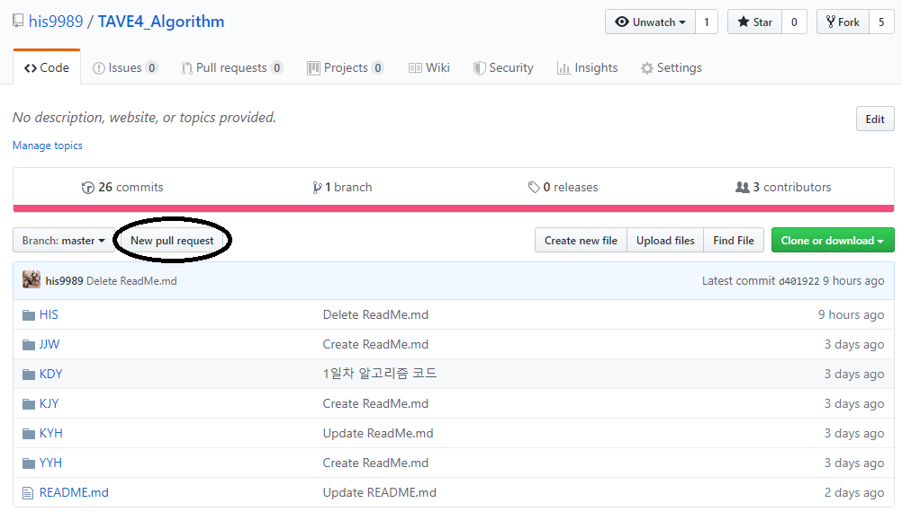
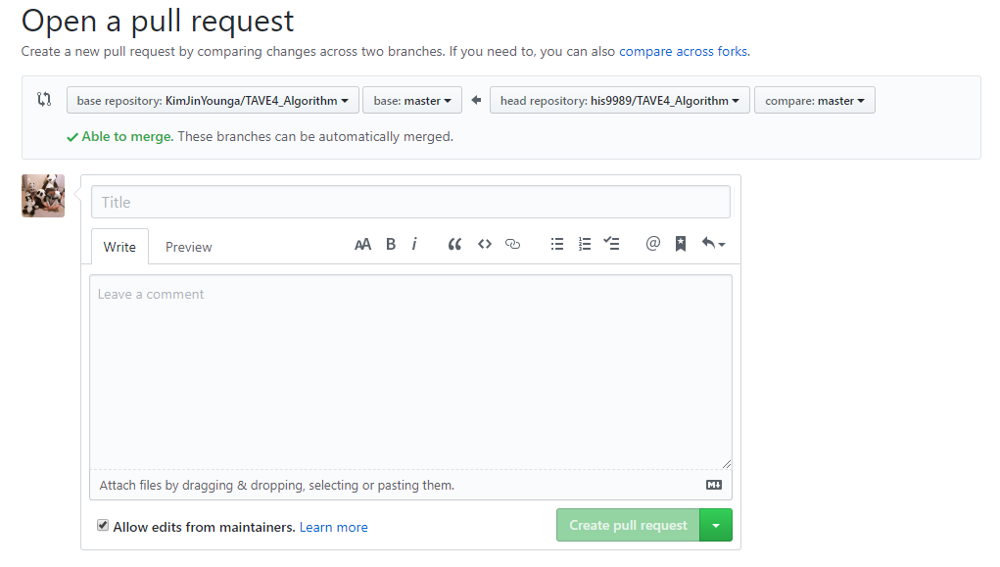
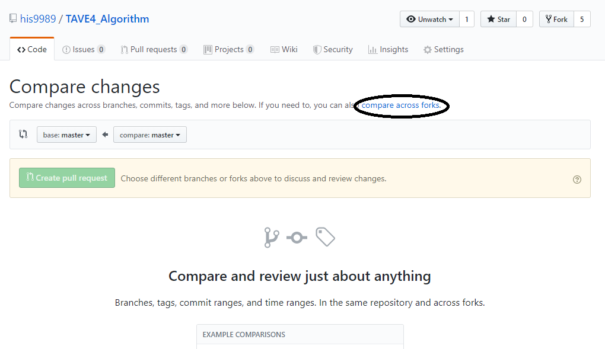

# TAVE4_Algorithm

### 4차 산업혁명 동아리 T-AVE 4기 알고리즘 실전반 스터디 
* Member:
  + 김도영(KDY), 김윤현(KYH), 김진영(KJY), 양윤희(YYH), 정지원(JJW), 한인수(HIS)
  
* Period:
  + 19.08.10 : OT
  + 19.08.13 : 트리 & 자료구조, 깃 설정
  + 19.08.17 : DFS, BFS
  + 19.08.17 : Coding Test
  + 19.08.20 : DFS, BFS, DP
  + 19.08.24 : Coding Test
  + 19.08.27 : DFS, BFS, DP
  + 19.09.03 : Coding Test

* Code Upload 방법
  + 1) his9989에서 본인계정으로 복사 : 
    + https://github.com/his9989/TAVE4_Algorithm 에서 New pull Request 클릭
    
  + 2) 본인계정<-his9989가 되도록 한 후, commit message 작성하여 Create pull request 클릭
    
  + 3) 단, New pull Request를 클릭했는데, 다음과 같은 화면이 나오면, 아래 검정색 동그라미 "compare across forks" 클릭
    
  + 4) 본인 계정의 TAVE4_Algorithm repository에서 upload files를 클릭한뒤, cpp파일을 드래그&드랍하고, 업로드한다.
  + 5) 본인계정에서 his9989로 New Pull Request한다.
    + 1~3과정과 같다.
